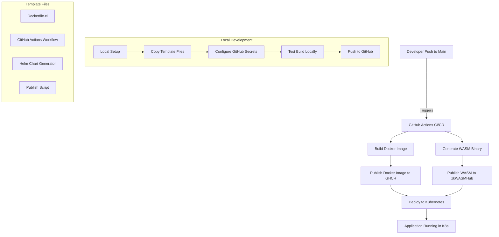

# zkwasm-devops-utils

## Overview

This repository provides a comprehensive set of DevOps templates and utilities for zkWASM projects. It includes tools for Dockerization, GitHub Actions workflows for building and deployment, Helm chart generation, and more. These templates streamline the process of transforming a zkWASM project into a production-ready, Kubernetes-deployable application.

## Workflow Chart



## Repository Purpose

This repository is designed to provide a set of templates and utilities that help zkWASM developers:

1. **Dockerize** their applications with proper configuration
2. Set up **GitHub Actions** for automated builds and deployments
3. Generate **Helm charts** for Kubernetes deployment
4. **Publish** WASM binaries to zkWASMHub
5. **Streamline** the entire DevOps workflow

**Important:** It is highly recommended to walk through the entire repository before applying these templates to your project. This will help you understand the workflow and customize it to your specific needs.

## Prerequisites
- Git installed
- Access to the zkWASM APP Project GitHub repository with Actions enabled
- Node.js and npm installed
- Kubernetes cluster access (for deployment)
- For other requirements, please refer to the [zkwasm development recipe](https://jupiterxiaoxiaoyu.github.io/zkwasm-development-recipe/getting-started/Setup%20Environment.html)

## Getting Started

### Key Components

#### 1. Dockerfile.ci

The `Dockerfile.ci` provides a standardized way to dockerize your zkWASM project. Key features include:

- Multi-stage build process for optimized image size
- Automatic admin key generation (uses default key or custom key from GitHub secrets)
- WASM binary optimization and packaging
- Secure handling of sensitive environment variables
- Publishing WASM binary to zkWASMHub during build process

You can use this Dockerfile as-is or customize it for your specific project needs.

#### 2. GitHub Actions Workflow

The `.github/workflows/ci-cd.yml` file sets up a complete CI/CD pipeline that:

- Builds your Docker image on every push to the main branch
- Publishes the Docker image to GitHub Container Registry (GHCR)
- Calculates and reports the MD5 hash of your WASM binary
- Optionally deploys to Kubernetes (commented out by default)

#### 3. Setup Script

The `scripts/setup-github-cicd.sh` script helps you configure all necessary GitHub secrets and variables for your CI/CD pipeline. It guides you through setting up:

- Server admin key
- Settler private account
- User address
- Kubernetes configuration
- Chain ID and other configuration parameters

Run this script to quickly set up your project with the correct secrets and environment variables.

#### 4. Helm Chart Generation

The `scripts/generate-helm.sh` script automatically generates Helm charts for Kubernetes deployment with configurable parameters:

- `CHART_NAME`: Name of your Helm chart (defaults to your GitHub repo name)
- `ALLOWED_ORIGINS`: CORS settings with comma-separated domain names
- `DEPLOY_VALUE`: Enable/disable task submission
- `REMOTE_VALUE`: Enable/disable remote synchronization
- `AUTO_SUBMIT_VALUE`: Configure auto submission
- `IMAGE_VALUE`: MD5 hash of your WASM file (automatically calculated during the Docker build process)

#### 5. Publish Script

The `scripts/publish.sh` script provides a sophisticated way to publish your WASM binary to zkWASMHub. It:

- Securely handles sensitive credentials
- Configures chain ID and other parameters
- Provides detailed logging and error handling

### Project Configuration Instructions

Follow these steps to apply the templates to your project:

1. **Add Required Configuration Files**
   - In your repository, add the following files (Already provided in the repo):
     - **Helm Chart Generation Script**
       - A script to generate Helm charts with these important parameters:
         - `CHART_NAME`: Set to your GitHub repo name (e.g., helloworld-rollup)
         - `ALLOWED_ORIGINS`: Configure CORS settings with comma-separated domain names
         - `DEPLOY_VALUE`: Set to `true` (default) to enable task submission
         - `REMOTE_VALUE`: Set to `true` (default) for remote synchronization
         - `AUTO_SUBMIT_VALUE`: Configure auto submission (optional)
         - `IMAGE_VALUE`: MD5 hash of your WASM file, automatically calculated during the Docker build process
         - Please leave the parameters as "" if you don't want to set them to "true"

     - **Environment Variables**
       - Add a `.env` file to configure essential environment variables
       ```bash
       # Create or edit the .env file
       nano .env
       
       # Example .env content:
       # SERVER_ADMIN_KEY=123
       # USER_ADDRESS=0x0000000000000000000000000000000000000000
       # USER_PRIVATE_ACCOUNT=0x0000000000000000000000000000000000000000
       ```

2. **Note on MD5 Hash Generation**
   - In our workflow, the MD5 hash of the WASM binary is automatically calculated during the Docker build process
   - This hash is used as the `IMAGE_VALUE` in the Helm chart generation
   - The CI/CD pipeline extracts this hash from the Docker container and reports it in the build summary

3. **Add CI/CD Workflow**
   - Add a GitHub Actions workflow file at `.github/workflows/ci-cd.yml` (Already provided in the repo):
     - Configure which branches and tags trigger the build process
     - Set up the build and deployment steps using pre-built WASM files
   ```bash
   # Create the workflows directory if it doesn't exist
   mkdir -p .github/workflows
   
   # Edit the CI/CD workflow file
   nano .github/workflows/ci-cd.yml
   ```

4. **Add Dockerfile for CI/CD**
   - Add a Dockerfile (Already provided in the repo) to build your project image as part of the CI/CD pipeline.
   ```bash
   # Edit the Dockerfile for CI/CD
   nano Dockerfile.ci
   ```


5. **Test the Publish Script**
   - Test the publish script and fix any issues. Sometimes there might be errors when running without the `-n` flag.
   - If needed, modify `ts/publish.sh`.
   ```bash
   # Make the publish script executable
   chmod +x ts/publish.sh
   
   # Test the publish script
   cd ts && ./publish.sh -n && cd ..
   
   # If needed, edit the publish script
   nano ts/publish.sh
   ```

6. **Push to GitHub**
   - Ensure your GitHub repository has Actions enabled.
   ```bash
   # Add all files to git
   git add .
   
   # Commit changes
   git commit -m "Configure DevOps setup for zkWASM project"
   
   # Push to GitHub
   git push origin main
   ```

### Kubernetes Deployment

1. **Access Your Cluster**
   - Connect to your Kubernetes cluster using the appropriate credentials.
   ```bash
   # Example for GKE
   gcloud container clusters get-credentials CLUSTER_NAME --zone ZONE --project PROJECT_ID
   
   # Example for AWS EKS
   aws eks update-kubeconfig --name CLUSTER_NAME --region REGION
   
   # Verify connection
   kubectl cluster-info
   ```

2. **Clone the Repository**
   ```bash
   # Clone your repository
   git clone https://github.com/YOUR_USERNAME/YOUR_REPO.git
   
   # Navigate to the repository
   cd YOUR_REPO
   ```

3. **Create a Dedicated Namespace and Secrets**
   - Note: The namespace determines your service API URL, which will be in the format `https://rpc.<namespace>.zkwasm.ai`
   ```bash
   # Create a namespace for your project
   kubectl create namespace YOUR_NAMESPACE
   
   # Create Kubernetes secrets
   kubectl create secret generic app-secrets \
   --from-literal=SETTLER_PRIVATE_ACCOUNT='settler-key-for-the-namespace' \
   --from-literal=SERVER_ADMIN_KEY='admin-key-for-the-namespace' \
   --from-literal=USER_ADDRESS='user-address-for-the-namespace' \
   --from-literal=USER_PRIVATE_ACCOUNT='user-private-key-for-the-namespace' \
   --namespace=YOUR_NAMESPACE
   ```

4. **Deploy with Helm**
   ```bash
   # Install the Helm chart
   helm install YOUR_RELEASE_NAME ./helm-charts/YOUR_CHART_NAME -n YOUR_NAMESPACE
   
   # Example:
   # helm install holdit-release ./helm-charts/holdit-devops -n holdit
   ```

5. **Monitor Deployment**
   ```bash
   # Watch the pods being created
   kubectl get pods -n YOUR_NAMESPACE -w
   
   # Check pod logs if needed
   kubectl logs POD_NAME -n YOUR_NAMESPACE
   
   # Check deployment status
   kubectl get deployments -n YOUR_NAMESPACE
   ```

6. **Access the RPC Service**
   - Your service will be available at: `https://rpc.<namespace>.zkwasm.ai`
   ```bash
   # Check the ingress status
   kubectl get ingress -n YOUR_NAMESPACE
   ```

## Automated Workflow

Once you've set up your project with these templates, the following automated workflow will be enabled:

1. **Trigger**: Any push to the main branch will trigger the GitHub Actions workflow.

2. **Build Process**:
   - The Docker image is built using `Dockerfile.ci`
   - WASM binary is compiled and optimized
   - MD5 hash of the WASM binary is calculated

3. **Publishing**:
   - Docker image is published to GitHub Container Registry (GHCR)
   - WASM binary is published to zkWASMHub (if credentials are provided)

4. **Deployment** (if enabled):
   - Helm charts are generated with the correct configuration
   - Application is deployed to Kubernetes

All of this happens automatically without any manual intervention, streamlining your DevOps process.

## Customization

While these templates provide a solid foundation, you may need to customize them for your specific project:

### Dockerfile Customization

If your project has specific build requirements, you can modify the `Dockerfile.ci` to include additional dependencies or build steps. The key sections to consider customizing are:

- System dependencies in the builder stage
- Build process for your WASM binary
- Environment variables and configuration

### GitHub Actions Workflow Customization

You can customize the `.github/workflows/ci-cd.yml` file to:

- Add additional build steps
- Modify the trigger conditions (e.g., specific branches or tags)
- Add testing or validation steps
- Enable or customize the deployment process

### Helm Chart Customization

The generated Helm charts can be customized by modifying the `scripts/generate-helm.sh` script or by directly editing the generated files in the `helm-charts` directory. Common customizations include:

- Resource limits and requests
- Additional environment variables
- Service configurations
- Ingress settings

## Troubleshooting

### Common Issues

1. **GitHub Actions Workflow Fails**
   - Check that all required secrets are set correctly
   - Verify that your repository has the necessary permissions for GitHub Actions
   - Check the workflow logs for specific error messages

2. **Docker Build Fails**
   - Ensure all dependencies are correctly specified
   - Check that your WASM compilation process works locally
   - Verify that the paths in the Dockerfile match your project structure

3. **WASM Publishing Fails**
   - Verify that `USER_ADDRESS` and `SETTLER_PRIVATE_ACCOUNT` are set correctly
   - Check network connectivity to the zkWASMHub service
   - Ensure your account has sufficient permissions

4. **Kubernetes Deployment Issues**
   - Verify that your Kubernetes configuration is correct
   - Check that the namespace exists and has the necessary resources
   - Ensure all required secrets are created in the namespace

### Getting Help

If you encounter issues not covered in this guide, please:

1. Check the GitHub repository issues for similar problems
2. Review the logs from GitHub Actions and Kubernetes for specific error messages
3. Reach out to the zkWASM community for assistance

## Conclusion

This repository provides a comprehensive set of DevOps templates and utilities for zkWASM projects. By following the instructions and utilizing these templates, you can streamline your development workflow and focus on building your zkWASM application rather than setting up infrastructure.

Remember to walk through the entire repository before applying these templates to your project to ensure you understand the workflow and can customize it to your specific needs.
   kubectl get ingress -n YOUR_NAMESPACE
   
   # Test the service
   curl https://rpc.YOUR_NAMESPACE.zkwasm.ai/health
   ```

### Project Configuration Instructions

To adapt this setup for your zkWASM project:
- Modify the Helm script:
  ```bash
  # Edit the generate-helm.sh script
  nano scripts/generate-helm.sh
  
  # Update CHART_NAME to match your project name
  # Example: CHART_NAME="your-project-name"
  
  # Configure ALLOWED_ORIGINS for CORS settings
  # Example: ALLOWED_ORIGINS="https://example.com,https://app.example.com"
  
  # Set deployment options
  # DEPLOY_VALUE="true"
  # REMOTE_VALUE="true"
  # AUTO_SUBMIT_VALUE=""
  
  # The IMAGE_VALUE will be automatically calculated during the Docker build process
  ```
- Update the `.env` file as needed for your project
  ```bash
  # Edit the .env file
  nano .env
  ```
- Adjust the `ci-cd.yml` workflow file to match your project's build requirements
  ```bash
  # Edit the CI/CD workflow file
  nano .github/workflows/ci-cd.yml
  ```
- Copy all configured files to the root directory of your zkWASM project
  ```bash
  # Example of copying files to another project
  cp -r scripts/ /path/to/your/zkwasm/project/
  cp -r .github/ /path/to/your/zkwasm/project/
  cp Dockerfile.ci /path/to/your/zkwasm/project/
  cp .env /path/to/your/zkwasm/project/
  ```

### Troubleshooting

- If GitHub Actions fail, check the workflow logs for specific errors
  ```bash
  # View GitHub Actions logs through the GitHub web interface
  # Navigate to your repository > Actions > Select the failed workflow
  ```
- For Kubernetes deployment issues, use `kubectl describe pod <pod-name> -n <namespace>` to get detailed error information
  ```bash
  # Get pod names
  kubectl get pods -n YOUR_NAMESPACE
  
  # Describe a specific pod
  kubectl describe pod POD_NAME -n YOUR_NAMESPACE
  
  # Check pod logs
  kubectl logs POD_NAME -n YOUR_NAMESPACE
  ```
- Ensure all required secrets are properly configured in your Kubernetes namespace
  ```bash
  # List Kubernetes secrets in your namespace
  kubectl get secrets -n YOUR_NAMESPACE
  ```

  